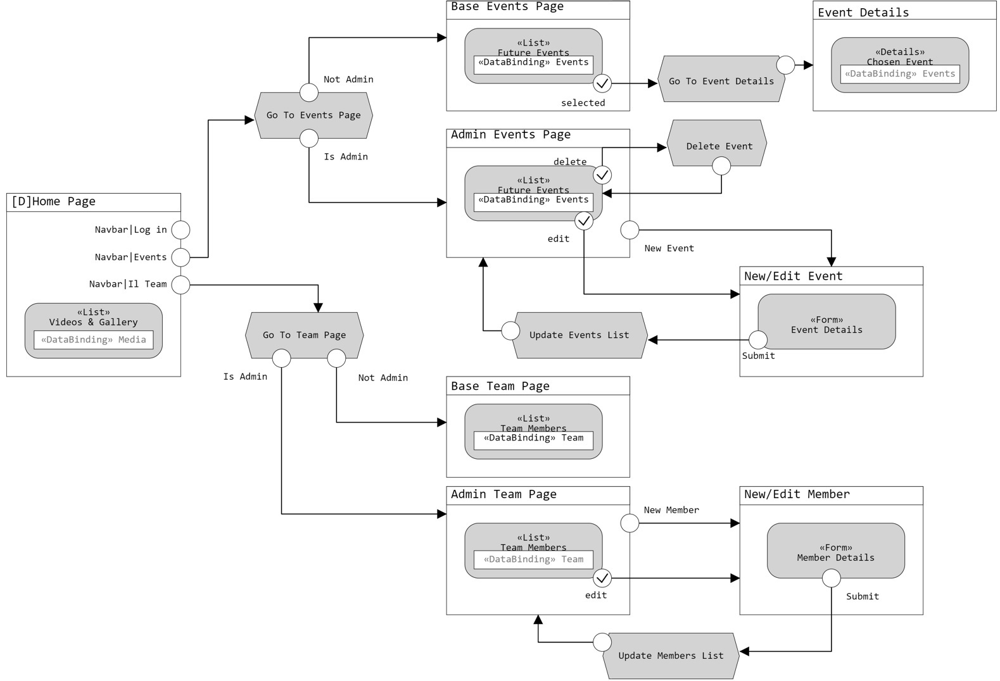
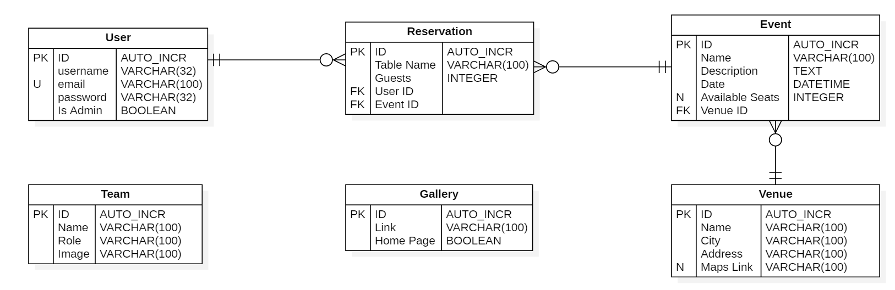

# ArcangeloDJ 2.0

Progetto per il corso di Programmazione Web e Servizi Digitali (AA. 2021/2022) di Matteo Beatrice

- [ArcangeloDJ 2.0](#arcangelodj-20)
  - [Descrizione](#descrizione)
    - [Funzionalità principali](#funzionalità-principali)
    - [Schemi di Alto Livello](#schemi-di-alto-livello)

## Descrizione
Creare versione aggiornata e dinamica del sito già esistente [arcangelodj.it](https://www.arcangelodj.it/)

### Funzionalità principali
* Diverse pagine navigabili tramite navbar
* Pagina __*Eventi*__ con visualizzazione degli eventi futuri
  * Se utente registrato (Attendee) anche possibilità di iscrizione all'evento indicando un nome per la prenotazione e il numero di partecipanti
  * Attendee può, nella sua area riservata, visualizzare e modificare/cancellare le sue prenotazioni
  * Possibilità di filtrare per Venue o per Data
* Pagina __*Team*__ con visualizzazione componenti del team
* Pagina __*Gallery*__ con immagini e video 
* Possibilità da parte di utenti di tipologia Team Member di aggiungere/modificare/cancellare:
  * _Eventi_ -> Contenti un nome, descrizione, data e ora, luogo(Venue) e, se limitati, il numero di posti disponibili
  * _Venue_ -> Luoghi dove si svolgeranno gli eventi contenenti: un nome, la città, indirizzo testuale e link Google Maps(non obbligatorio)
  * _Membri del Team_ -> Con nome, ruolo e immagine
  * _Gallery Items_
* Scelta della lingua di visualizzazione (Italiano/Inglese)

### Schemi di Alto Livello
Idea iniziale struttura pagine sito
  

Schema E/R Database
